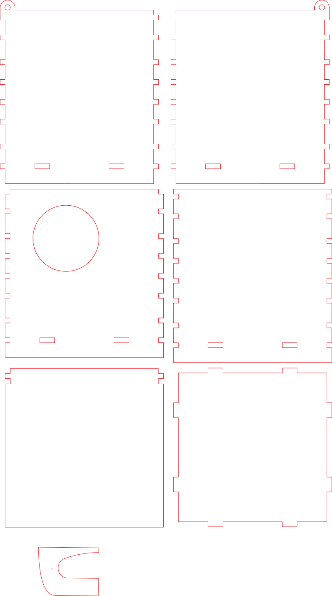
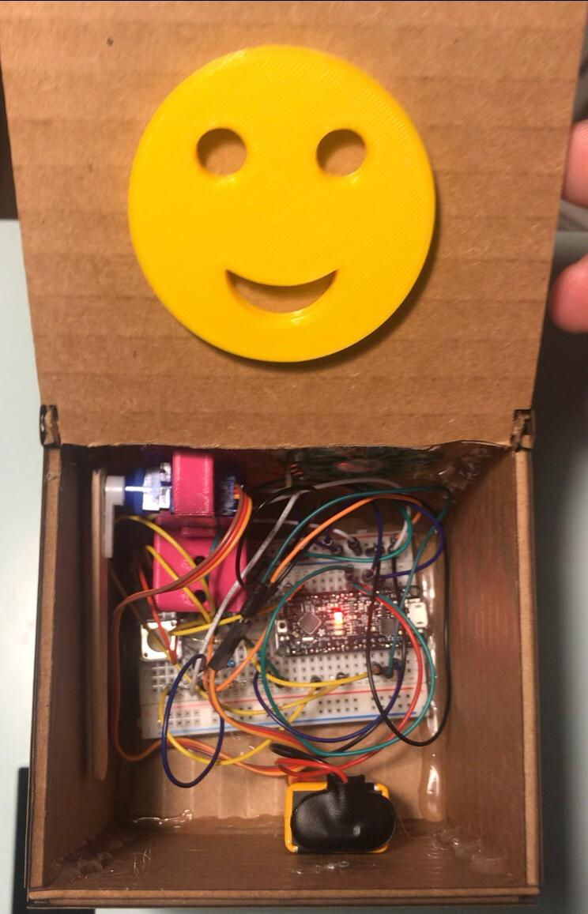
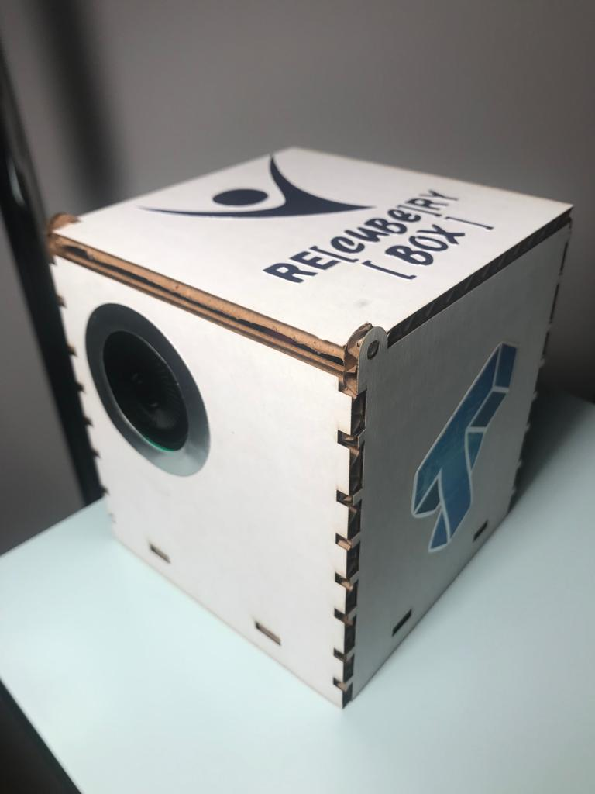

# Jack in the Box

## Design

Please put your sketches or designs for the Jack in the Box.

## Laser Cutting

**Laser Cutter File** 

## 3D Printing

**a. Include a photo of your printed part here.**

**b. Include `.stl` or `.svg` files if you made modifications.**
The STL Files are maintained in this directory: https://github.com/joAQUINCE/IDD-Fa19-Lab5

## Electronics

**a. Upload code & a photo of your electronic circuit here.**

My Arduino code is maintained in this directory: https://github.com/joAQUINCE/IDD-Fa19-Lab5/tree/master/arduino

Note that for playing sound using PWM Pin, the sounddata.h must be saved in the same directory as .INO file.

## Putting it All Together

Include here:

My Arduino code is maintained in this directory: https://github.com/joAQUINCE/IDD-Fa19-Lab5/tree/master/arduino
The code is also pasted at the end of this report. Note that for playing sound using PWM Pin, the sounddata.h must be saved in the same directory as .INO file.

1. At least one photo of your Jack in the Box taken in the MakerLab's Portable Photo Studio (or somewhere else, but of similar quality).

## 1. A video of your Jack in the Box in action.

Videos of the Jack is maintained in the following URLs: 
https://youtu.be/N-BVdGN9zDM
https://youtu.be/gYxZ4OLi8rU

## ARDUINO CODE

/*******************************************/
/* Speaker Includes / Defines / Initialize */
#include <stdint.h>
#include <avr/interrupt.h>
#include <avr/io.h>
#include <avr/pgmspace.h>
#define SAMPLE_RATE 8000

#include "sounddata.h"

int ledPin = 13;
int speakerPin = 11; // Can be either 3 or 11, two PWM outputs connected to Timer 2
volatile uint16_t sample;
byte lastSample;
/**********************************************************/
// Accelerometer Includes / Defines / Initialize */

#include <SPI.h>
#include <Adafruit_LIS3DH.h>
#include <Adafruit_Sensor.h>

// Used for software SPI
#define LIS3DH_CLK A5
#define LIS3DH_MISO A4
//#define LIS3DH_MOSI 11
// Used for hardware & software SPI
//#define LIS3DH_CS 9

Adafruit_LIS3DH lis = Adafruit_LIS3DH();

/**********************************************************/
// Servo Includes / Defines / Initialize */

int servoPin = 10;
int pulse = 150;
int previous_time = 0;
int servoReset = 2;

/**********************************************************/
// Audio Playback Functions

void stopPlayback()
{
    // Disable playback per-sample interrupt.
    TIMSK1 &= ~_BV(OCIE1A);

    // Disable the per-sample timer completely.
    TCCR1B &= ~_BV(CS10);

    // Disable the PWM timer.
    TCCR2B &= ~_BV(CS10);

    digitalWrite(speakerPin, LOW);
}

// This is called at 8000 Hz to load the next sample.
ISR(TIMER1_COMPA_vect) {
    if (sample >= sounddata_length) {
        if (sample == sounddata_length + lastSample) {
            stopPlayback();
        }
        else {
            if(speakerPin==11){
                // Ramp down to zero to reduce the click at the end of playback.
                OCR2A = sounddata_length + lastSample - sample;
            } else {
                OCR2B = sounddata_length + lastSample - sample;                
            }
        }
    }
    else {
        if(speakerPin==11){
            OCR2A = pgm_read_byte(&sounddata_data[sample]);
        } else {
            OCR2B = pgm_read_byte(&sounddata_data[sample]);            
        }
    }

    ++sample;
}

void startPlayback()
{
    pinMode(speakerPin, OUTPUT);

    // Set up Timer 2 to do pulse width modulation on the speaker
    // pin.

    // Use internal clock (datasheet p.160)
    ASSR &= ~(_BV(EXCLK) | _BV(AS2));

    // Set fast PWM mode  (p.157)
    TCCR2A |= _BV(WGM21) | _BV(WGM20);
    TCCR2B &= ~_BV(WGM22);

    if(speakerPin==11){
        // Do non-inverting PWM on pin OC2A (p.155)
        // On the Arduino this is pin 11.
        TCCR2A = (TCCR2A | _BV(COM2A1)) & ~_BV(COM2A0);
        TCCR2A &= ~(_BV(COM2B1) | _BV(COM2B0));
        // No prescaler (p.158)
        TCCR2B = (TCCR2B & ~(_BV(CS12) | _BV(CS11))) | _BV(CS10);

        // Set initial pulse width to the first sample.
        OCR2A = pgm_read_byte(&sounddata_data[0]);
    } else {
        // Do non-inverting PWM on pin OC2B (p.155)
        // On the Arduino this is pin 3.
        TCCR2A = (TCCR2A | _BV(COM2B1)) & ~_BV(COM2B0);
        TCCR2A &= ~(_BV(COM2A1) | _BV(COM2A0));
        // No prescaler (p.158)
        TCCR2B = (TCCR2B & ~(_BV(CS12) | _BV(CS11))) | _BV(CS10);

        // Set initial pulse width to the first sample.
        OCR2B = pgm_read_byte(&sounddata_data[0]);
    }

    // Set up Timer 1 to send a sample every interrupt.

    cli();

    // Set CTC mode (Clear Timer on Compare Match) (p.133)
    // Have to set OCR1A *after*, otherwise it gets reset to 0!
    TCCR1B = (TCCR1B & ~_BV(WGM13)) | _BV(WGM12);
    TCCR1A = TCCR1A & ~(_BV(WGM11) | _BV(WGM10));

    // No prescaler (p.134)
    TCCR1B = (TCCR1B & ~(_BV(CS12) | _BV(CS11))) | _BV(CS10);

    // Set the compare register (OCR1A).
    // OCR1A is a 16-bit register, so we have to do this with
    // interrupts disabled to be safe.
    OCR1A = F_CPU / SAMPLE_RATE;    // 16e6 / 8000 = 2000

    // Enable interrupt when TCNT1 == OCR1A (p.136)
    TIMSK1 |= _BV(OCIE1A);

    lastSample = pgm_read_byte(&sounddata_data[sounddata_length-1]);
    sample = 0;
    sei();
}

void setup()

{
  /**********************************************************/
// Audio Playback Setup Function
    delay(5000);
    pinMode(ledPin, OUTPUT);
    digitalWrite(ledPin, HIGH);
    startPlayback();

/**********************************************************/
// Accelerometer Setup Function
#ifndef ESP8266
  while (!Serial);     // will pause Zero, Leonardo, etc until serial console opens
#endif

  Serial.begin(9600);
  Serial.println("LIS3DH test!");
  
  if (! lis.begin(0x18)) {   // change this to 0x19 for alternative i2c address
    Serial.println("Couldnt start");
    while (1);
  }
  Serial.println("LIS3DH found!");
  
  lis.setRange(LIS3DH_RANGE_4_G);   // 2, 4, 8 or 16 G!
  
  Serial.print("Range = "); Serial.print(2 << lis.getRange());  
  Serial.println("G");

/**********************************************************/
// Servo Setup Function

  pinMode(servoPin, OUTPUT);

}

void loop()
{  
  
   digitalWrite(servoPin, HIGH);
   delayMicroseconds(pulse);
   digitalWrite(servoPin, LOW);
   delay(20);
  /**********************************************************/
  // Accelerometer Loop Function

  lis.read();      // get X Y and Z data at once
  // Then print out the raw data
  Serial.print("X:  "); Serial.print(lis.x); 
    if (abs(lis.x>=3000)){
      pulse = 1550;
//        Servo Loop Function
//        digitalWrite(servoPin, HIGH);
//        delayMicroseconds(min(lis.x,1600));
//        digitalWrite(servoPin, LOW);
//        delay(20);
    }
  Serial.print("  \tY:  "); Serial.print(lis.y); 
   if (abs(lis.y>=3000)){
       // Servo Loop Function
   pulse = 1550;
//       digitalWrite(servoPin, HIGH);
//       delayMicroseconds(min(lis.y,1600));
//       digitalWrite(servoPin, LOW);
//       delay(20);
    }
  Serial.print("  \tZ:  "); Serial.print(lis.z); 

  /* Or....get a new sensor event, normalized */ 
  sensors_event_t event; 
  lis.getEvent(&event);
  
  /* Display the results (acceleration is measured in m/s^2) */
  Serial.print("\t\tX: "); Serial.print(event.acceleration.x);
  Serial.print(" \tY: "); Serial.print(event.acceleration.y); 
  Serial.print(" \tZ: "); Serial.print(event.acceleration.z); 
  Serial.println(" m/s^2 ");

  Serial.println();
 
  delay(200); 

   /**********************************************************/

   
}
