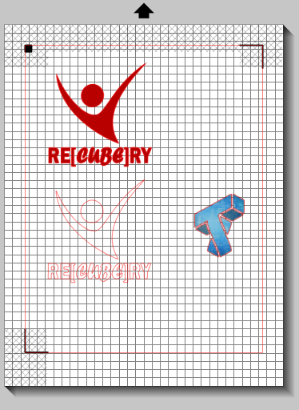

# Jack in the Box

## Design

Please put your sketches or designs for the Jack in the Box.

## Laser Cutting

## 3D Printing

**The STL Files for the smiley face I designed are mantained here: [STL Files](https://github.com/joAQUINCE/IDD-Fa19-Lab5/blob/master/ec833_smiley.stl)**

## Electronics

## Arduino Code

My Arduino code is maintained here: [My Arduino Code](https://github.com/joAQUINCE/IDD-Fa19-Lab5/tree/master/arduino)

## Putting it All Together

## 1. A video of your Jack in the Box in action.

Videos of my "Jack in the Box" design  maintained in the following URLs: 

[Jack in the Box - Video 1](https://youtu.be/gYxZ4OLi8rU)

[Jack in the Box - Video 2](https://youtu.be/N-BVdGN9zDM)

